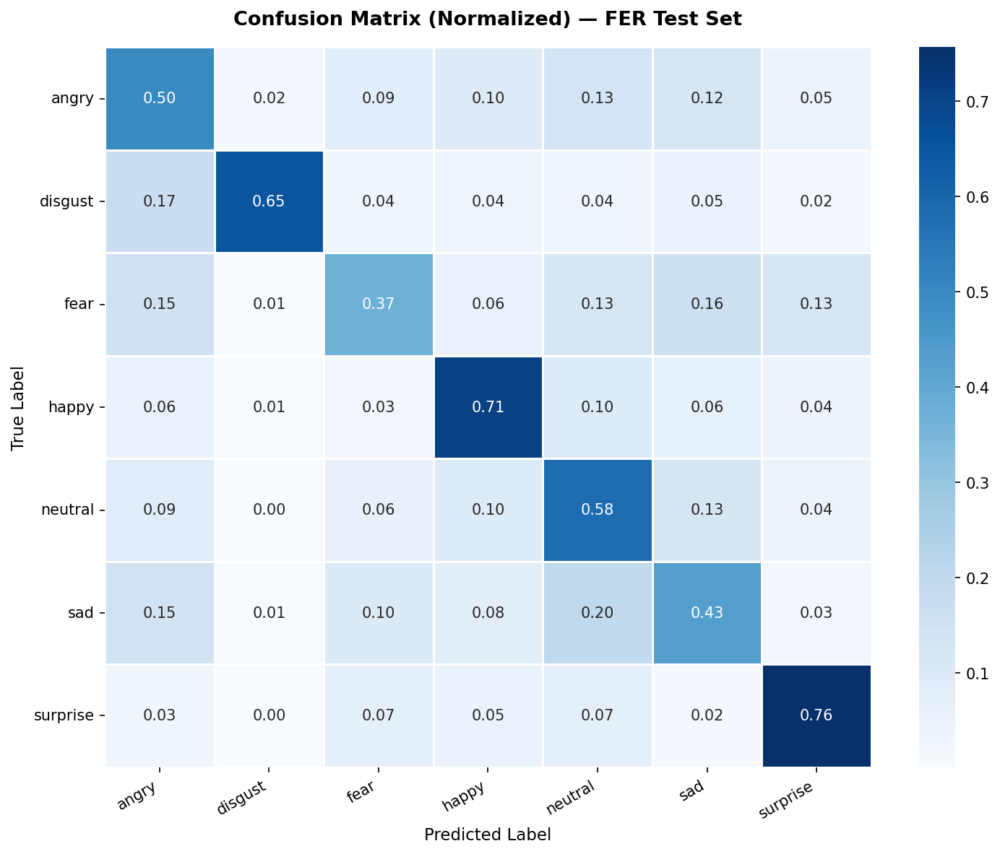
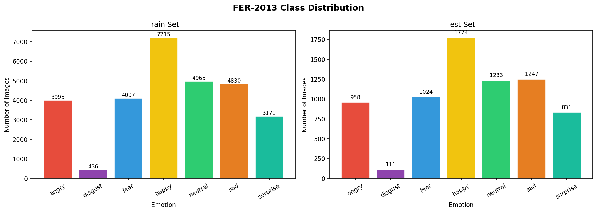
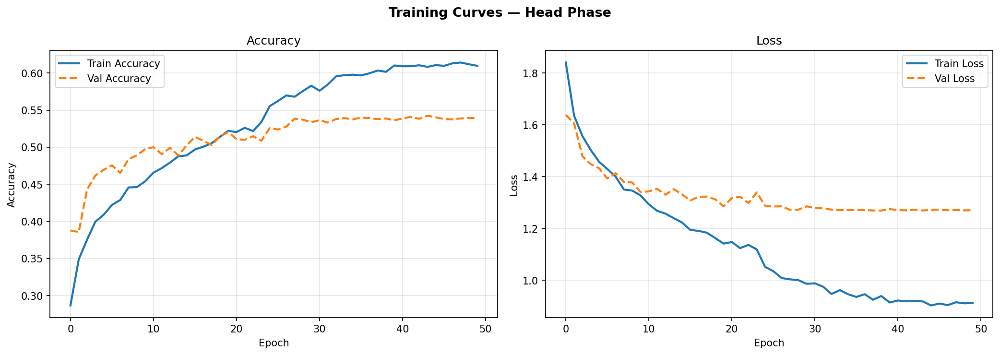
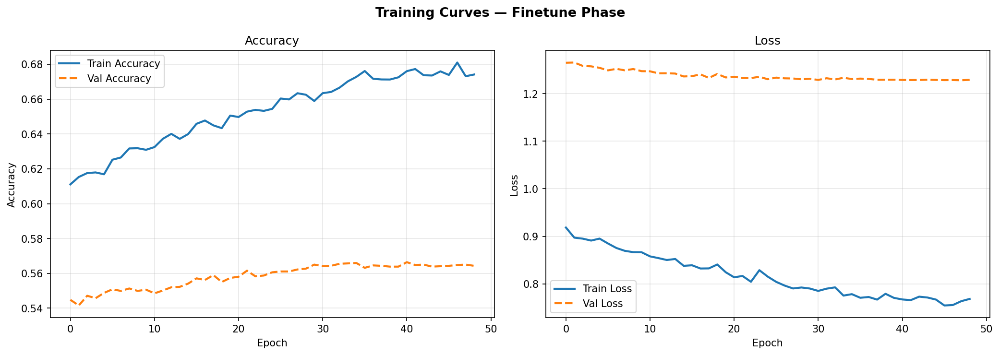
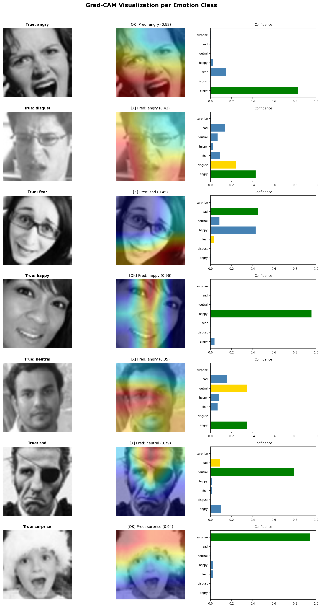

# Facial Emotion Recognition

A deep learning project for classifying 7 human emotions from facial images using EfficientNetB0 transfer learning with two-phase training.



## Results

| Metric | Value |
|--------|-------|
| Test Accuracy | 56.60% |
| Macro F1-Score | 0.5604 |
| Best Class (F1) | happy (0.7289) |
| Weakest Class (F1) | fear (0.4239) |

> **Note:** FER-2013 is a notoriously noisy dataset. Human-level accuracy is ~65%, making 56.6% a solid baseline.

## Emotion Classes

`angry` · `disgust` · `fear` · `happy` · `neutral` · `sad` · `surprise`

## Model Architecture

- **Backbone:** EfficientNetB0 (pretrained on ImageNet)
- **Preprocessing:** Rescaling layer `[0,1] → [0,255]` for EfficientNet compatibility
- **Head:** GlobalAveragePooling2D → BatchNorm → Dense(256) → Dropout(0.4) → Dense(128) → Dropout(0.3) → Softmax(7)
- **Training:** Two-phase strategy
  - Phase A: Head-only training (backbone frozen), LR = 1e-3
  - Phase B: Fine-tuning top 30 layers (BatchNorm frozen), LR = 1e-5
- **Class weights:** Applied to handle `disgust` class imbalance (9.4×)

## Dataset

[FER-2013](https://www.kaggle.com/datasets/msambare/fer2013) — 35,887 grayscale 48×48 face images

| Split | Images |
|-------|--------|
| Train | 24,403 |
| Val   | 4,306  |
| Test  | 7,178  |

## Project Structure
```
facial-emotion-recognition/
├── src/
│   ├── config.py          # All hyperparameters & paths
│   ├── prepare_data.py    # Download dataset & tf.data pipeline
│   ├── train.py           # Two-phase EfficientNetB0 training
│   ├── evaluate.py        # Confusion matrix, metrics & Grad-CAM
│   └── predict.py         # Inference on new images
├── outputs/
│   ├── class_distribution.png
│   ├── confusion_matrix.png
│   ├── gradcam_visualization.png
│   ├── training_curves_head.png
│   ├── training_curves_finetune.png
│   └── classification_report.txt
├── models/                # Saved model checkpoints (not tracked)
├── requirements.txt
└── .gitignore
```

## Setup & Usage

### Google Colab
```bash
# 1. Download dataset (re-run each session)
python src/prepare_data.py

# 2. Train model
python src/train.py

# 3. Evaluate on test set
python src/evaluate.py

# 4. Predict on a new image
python src/predict.py --image photo.jpg
python src/predict.py --image photo.jpg --save   # save annotated output
```

### Local (venv)
```bash
python -m venv venv && source venv/bin/activate
pip install -r requirements.txt

python src/prepare_data.py
python src/train.py
python src/evaluate.py
python src/predict.py --image photo.jpg
```

## Key Learnings vs Previous Project

| Topic | Face Mask Detection | This Project |
|-------|-------------------|--------------|
| Task | Binary classification | 7-class classification |
| Architecture | MobileNetV2 | EfficientNetB0 |
| Data pipeline | ImageDataGenerator | tf.data + augmentation |
| Training strategy | Single phase | Two-phase (head → fine-tune) |
| Class imbalance | None | Class weights |
| Explainability | None | Grad-CAM visualization |
| Preprocessing | Manual normalize | Rescaling layer in model |

## Visualizations

### Class Distribution


### Training Curves — Phase A (Head)


### Training Curves — Phase B (Fine-tune)


### Grad-CAM — What the Model Sees


## Tech Stack

- Python 3.12
- TensorFlow 2.19.0
- OpenCV 4.13.0
- Scikit-learn 1.6.1
- Matplotlib 3.10.0
- Seaborn 0.13.2
